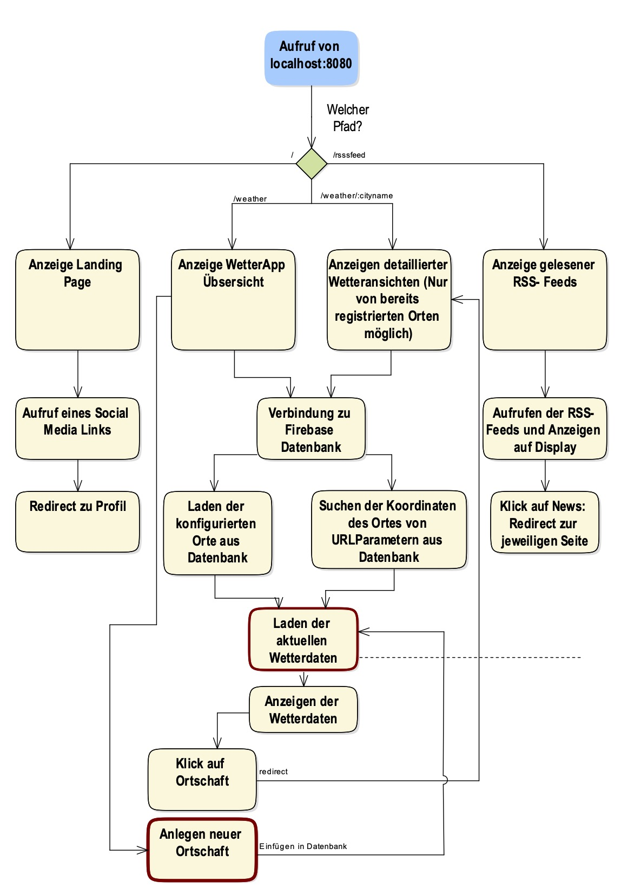
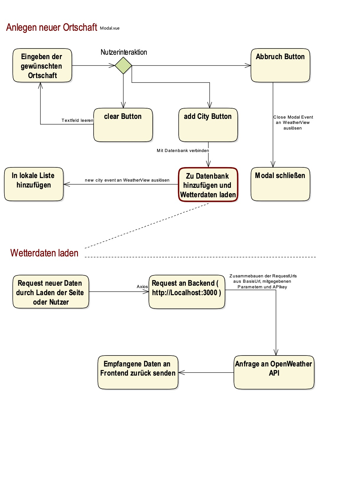
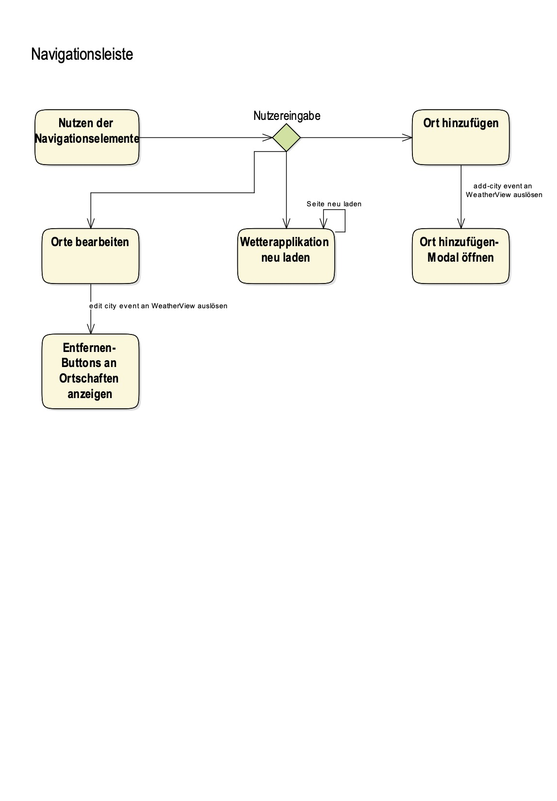

# Webengeneering Abschlussabgabe
**Bitte dieses Dokument in einem Markdowneditor mit Preview öffnen, wie zum Beispiel Visual Studio Code.**

Alternativ kann die ReadMe als Vorschau auch auf [GitHub](https://github.com/Patsch36/FBB-Remaster/blob/main/README.md) angesehen werden.

## Installation und Start
Um die Website zu starten, müssen zwei Terminals im root Verzeichnis geöffnet werden.
Danach werden folgende Commands ausgeführt:

### Anzulegende Dateien
Den Inhalt dieses Kapitels hast du in meiner Mail bekommen. um dieses sauber formatiert anzuzeigen, kannst du ihn hier rein kopieren.

Wir wissen ja beide, dass es eine unkluge Idee ist, seine Keys zu veröffentlichen ;)

### Terminal 1

Um erforlderliche Moudle zu installieren
````
npm install
````

Um den Vue.js Webserver zu startet:
````
npm run serve
````

### Terminal 2
Um in das backend directory zu gelanden:
````
cd backend
````

Um erforlderliche Moudle zu installieren
````
npm install
````

Um das backend zu starten
````
nodemon index.js
````


## Flowchart





## Bewertung der Vorlesung
Die Vorlesung war im Raum der geringen Zeit ausgewogen gestaltet und es kamen viele wichtige Themen vor, um Webentwicklung zu lernen.
Allerdings hätte gerade das Verständnis von CSS besser entwickelt werden können, wenn du anstatt es von deinen Slides abzulesen in einem kleinen Projekt live angewendet hättest ;D